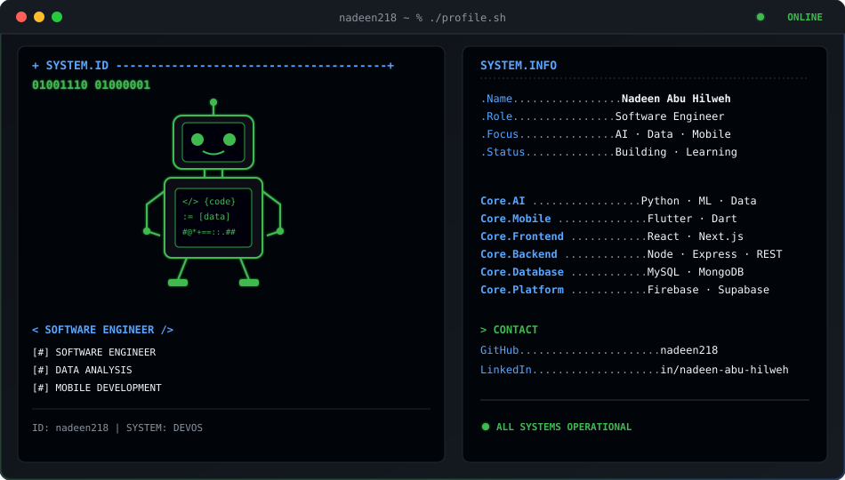

<!-- Navy Blue Dynamic Header Banner -->

### 🤖 Software Engineer · 📊 Data Analyst · 📱 Flutter Developer

 

  

---

## 💻 Technical Stack

### Artificial Intelligence & Data Science

### Mobile Development & DevOps

### Web Development & Backend Services

### Databases, Cloud & Containerization

### Programming Languages & Developer Tools

---

## ⚙️ Core System Modules

| Module | Architecture Focus | Deployment Status |
| :--- | :--- | :---: |
| 🧠 **INTELLIGENCE** | Predictive Models · ML Pipelines · Advanced Data Analysis | `ACTIVE` |
| 📱 **DEVELOPMENT** | Cross-Platform Mobile Apps · Full-Stack Mobile · UI/UX | `ACTIVE` |
| 🛠️ **ENGINEERING** | Containerization · Mobile CI/CD · Cloud Hosting · DB Design | `ACTIVE` |

---

## 🚀 Technical Core Diagnostics

| Diagnostic Check | Core Technology Stack | Status |
| :--- | :--- | :---: |
| **Intelligence Modules** | `Python` · `Pandas` · `NumPy` · `Scikit-Learn` |  |
| **Mobile Systems & CI/CD** | `Flutter` · `Dart` · `Codemagic` · `OneSignal` |  |
| **Backend & Infrastructure** | `Node.js` · `Express` · `Docker` · `Render` |  |
| **Database Drivers** | `PostgreSQL` · `MySQL` · `MongoDB` · `Mongoose` |  |

---

<!-- Navy Blue Dynamic Footer Banner -->

